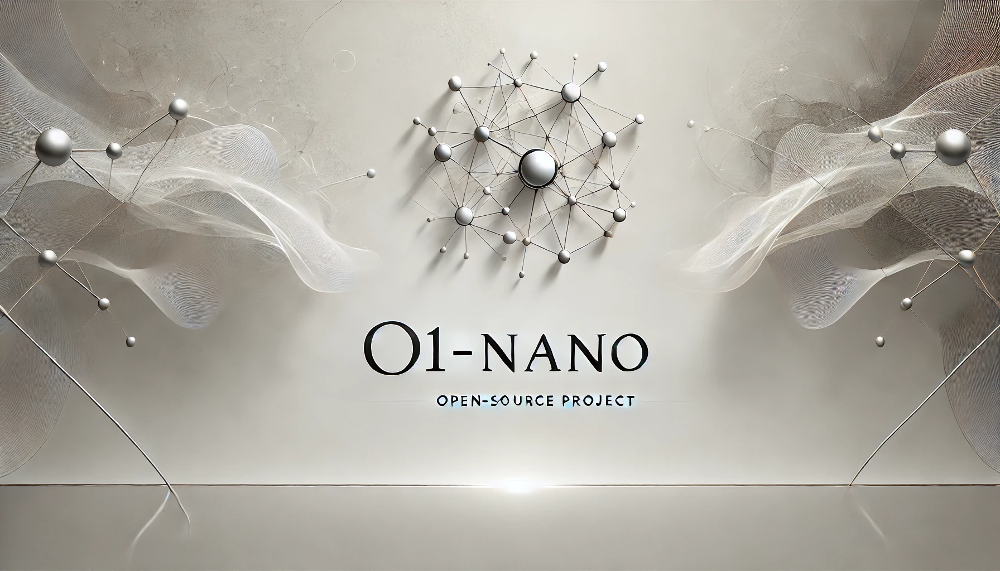

# O1 Nano



## Overview

This project implements a simplified version of the O1 model, inspired by OpenAI's research. The O1 model is an advanced language model that integrates chain-of-thought reasoning with reinforcement learning during both training and inference. This implementation, called O1-nano, focuses on arithmetic problem-solving as a demonstration of the model's capabilities. Based of [this](https://youtu.be/sf7Ntg72qCI) video on Youtube by Siraj Raval.

## Key Features

1. **Chain-of-Thought Reasoning**: The model generates both completion tokens and internal reasoning tokens, simulating a thought process.
2. **Reinforcement Learning**: Uses Proximal Policy Optimization (PPO) for training.
3. **Multiple Reasoning Paths**: Explores multiple paths and selects the best one during generation.
4. **Subtask Generation**: Capable of breaking down complex problems into smaller subtasks.
5. **Adaptive Reasoning**: Includes mechanisms for revising reasoning during the generation process.
6. **Large Context Window**: Supports a context window of up to 128,000 tokens.
7. **Internal Reasoning Tokens**: Implements discardable internal tokens for reasoning.

## Files

- `train.py`: Contains the model architecture, training loop, and utility functions.
- `test.py`: Provides a simple interface for interacting with a trained model.
- `config.json`: Configuration file for model and training parameters.
- `requirements.txt`: Python dependencies.

## Model Architecture

The O1Model class in `train.py` defines the model architecture:

- Embedding layer
- Positional encoding
- Multiple transformer layers
- Separate decoders for completion and reasoning
- Value head for reinforcement learning
- Subtask generation head

## Training Process

The training process combines supervised learning and reinforcement learning:

1. **Data Generation**: Arithmetic problems are generated on-the-fly.
2. **Supervised Learning**: The model is trained to predict correct solutions and reasoning steps.
3. **Reinforcement Learning**: PPO is used to optimize the model's policy based on rewards.
4. **Dynamic Curriculum**: Problem difficulty is adjusted based on the training progress.

## Usage

### Installation

```bash
pip install -r requirements.txt
```

### Training

To train the model, run:

```bash
python train.py --config config.json --output o1_model.pth
```

This will train the model for 500 epochs and save it as `o1_model.pth`.

### Testing

To interact with a trained model, run:

```bash
python test.py --model o1_model.pth --config config.json
```

This will load the trained model and allow you to input arithmetic problems for the model to solve.

## Requirements

- Python 3.7+
- PyTorch 1.8+
- tqdm
- numpy

## Model Parameters

See `config.json` for all configurable parameters.

## Vocabulary

The model uses a custom vocabulary tailored for arithmetic operations, including special tokens for subtasks and reasoning steps.

## Evaluation

The model is evaluated based on its ability to correctly solve arithmetic problems. The evaluation metrics include average reward and the number of valid samples processed.

## Configuration

The `config.json` file contains all hyperparameters:

- Model architecture settings
- Training parameters
- Generation settings
- Data generation parameters

## Logging

Training logs are output to the console with progress bars and metrics.

## Limitations and Future Work

1. **Scale**: This implementation is smaller than the actual O1 model described by OpenAI.
2. **Task Diversity**: Currently focused on arithmetic; could be expanded to more diverse tasks.
3. **Self-Correction**: The self-correction mechanism could be made more sophisticated.
4. **Dynamic Curriculum**: The difficulty adjustment could be more adaptive to the model's performance.

## Contributing

Contributions to improve the model or expand its capabilities are welcome. Please submit pull requests or open issues for any bugs or feature requests.

## Acknowledgements

This implementation is inspired by OpenAI's research on the O1 model. It is a simplified version 
